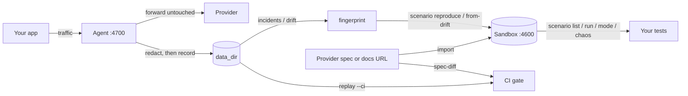

You built against someone else's API. Two things go wrong, and neither is your fault.

**You cannot rehearse failure.** The provider's sandbox is happy-path only. You cannot make a charge decline in an unusual way, or time out halfway through, so you discover how your code handles it in production with real money.

**They change things without telling you.** A field is renamed. A status value that was always `success` starts arriving as `succeeded`. The changelog is silent, or nobody read it.

Detecting the change is the easy part. The rest is being able to reproduce it, fix it, and keep it fixed. pikopod is one cycle, and each stage feeds the next.

## The stages

| | Stage | What it does | Command |
|---|---|---|---|
| 0 | **Gate** | Fail the build when a spec changes shape. No proxy, no account. | `pikopod spec-diff` |
| 1 | **Integrate** | A spec becomes a stateful sandbox. | `pikopod import` |
| 2 | **Rehearse** | Every failure production will throw, not just the happy path. | `pikopod scenario list` · `run` · `chaos` · `mode` |
| 3 | **Ship** | | |
| 4 | **Observe** | A proxy watches your traffic for failures and shape changes, while the spec watcher watches what they publish. | `pikopod up` · `incidents` |
| 5 | **Reproduce** | The failure becomes a runnable scenario in that same sandbox. | `pikopod reproduce` |
| 6 | **Fix and prove** | Run the scenario against the repair. | `pikopod fix` · `scenario check` |
| 7 | **Regress forever** | Keep the scenario in offline CI. | `pikopod agent replay --ci` |

**Stage 5 is the one nothing else does.** You cannot ask a provider's sandbox to return that exact 503, with that body, at that point in your state machine. pikopod can, because the same tool recorded it and owns the sandbox. Mocking tools have a sandbox and no observer; monitoring tools have an observer and no sandbox.

You do not have to adopt all of it. Stage 0 is the usual on-ramp: one line in CI, nothing installed in your request path. Import and the sandbox need no proxy at all.

## Three tenses of one question

Everything pikopod does answers *"what is this API about to do to me?"*, asked about three different times. Each part covers what the others structurally cannot.

| | Sandbox | Observing agent | Replay |
|---|---|---|---|
| **Tense** | Future / conditional | Present | Past |
| **Answers** | What happens when they ship the new spec? When they decline? When they time out? | Did it actually happen, and is it on my wire now? | What exactly happened. Prove the fix against it. |
| **Needs** | A spec. Works on day one. | Nothing for an incident: a failed request is a fact about itself. 48 hours of traffic before drift, which is a claim about what is *normal*. | Recordings plus a frozen baseline, so it inherits the warmup. |

The sandbox is where you rehearse. The agent is the smoke detector. Replay is the evidence.

## How the parts fit

One config file, one `data_dir`, one command. `pikopod up` starts two listeners in one process: the sandbox on `:4600` and the agent on `:4700`. They share the data directory and fail independently. If the sandbox listener dies, the message is loud and the agent keeps serving. Your production traffic does not depend on the sandbox being up.

`up` always starts both listeners. The spec watcher is also part of `up`, not a separate command, and arms per upstream whenever `spec_source` is set. Recordings made by the agent answer the sandbox before the spec once they exist, and `sandbox list` says so; see [Precedence](/sandbox/precedence). They also score it: `pikopod agent truthfulness` says how much of what the provider sent the sandbox reproduces. See [Truthfulness](/observe/truthfulness).

## It also crosses the two sides

A spec-diff tool reads what the provider *published*. Monitoring sees your traffic but throws response bodies away. pikopod holds both, so it can say things neither can:

> The spec removed this endpoint, and you're still sending it 120 requests a day.

Traffic evidence raises the severity of a declared change. A declared change downgrades an observed one to "documented, not silent". Holding both sides is why a reproduction is possible at all.

## What pikopod refuses to do

The refusals are the design, not gaps in it.

- **It never alerts on latency.** Latency is noisy, environment-dependent, and rarely provable from the bytes. A request that failed is an incident; a request that was merely slow is nothing. pikopod sets no upstream timeout of its own, so an incident fires when *your caller* gives up, not when a stopwatch says so.
- **It never enforces a guess.** Model-extracted fields are simulated but marked DRAFT, capped in severity, never unlock redaction, and cannot bind an archetype without an explicit `--bind`.
- **It never advances your pin on its own.** A provider publishing a new spec generates findings; accepting them is an explicit `import --update`.
- **It never lets internal failure touch your traffic.** Observation is bounded and panic-isolated, and the proxy does not retry.
- **It never reports clean when it cannot tell.** `UNVERIFIABLE` is a real outcome, distinct from a pass. See [Exit codes](/operations/exit-codes).
